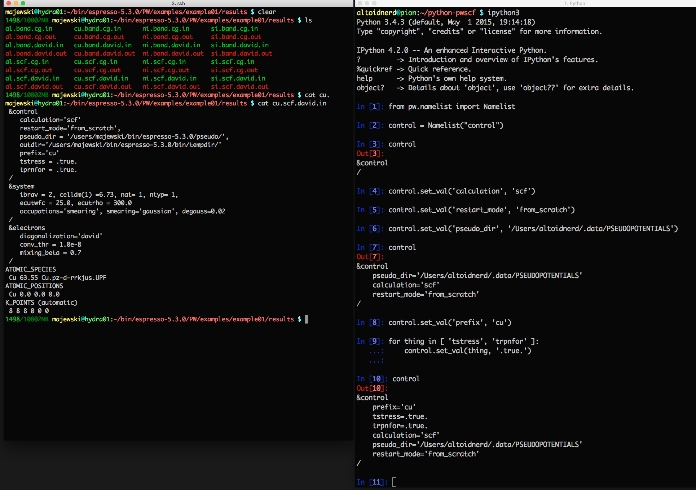
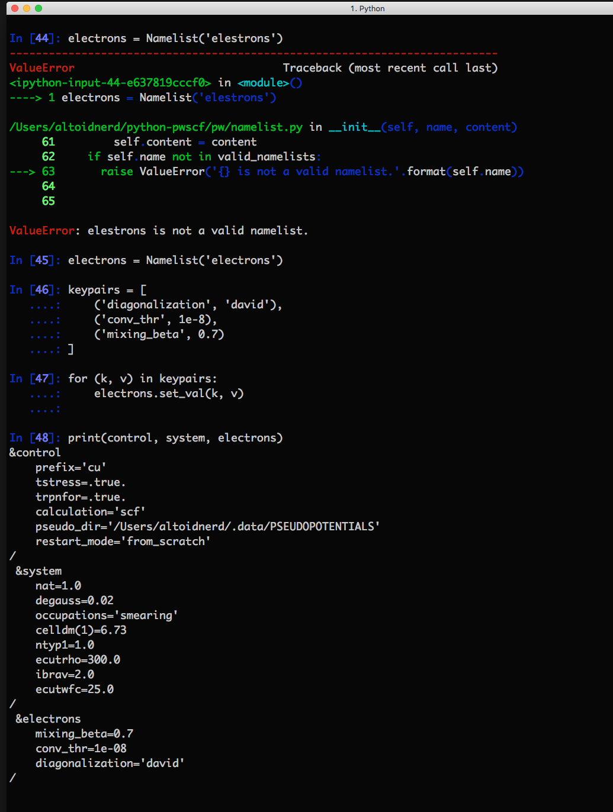

# python-pwscf

* classes for parsing and manipulating data from pw.x, and gipaw.x
  - ```md.Md(infile, outfile)``` is an object for fetching data from molecular dynamics simulations using pw.x
  - ```efg.Efg(outfile)``` is an object for fetching data from EFG calculations with gipaw.x
* ```namelist.Namelist()``` is for scripting the creation of input files for pw.x


#####A python wrapper for QE data creation/parsing that retains the expressiveness of the python language.
 looks like the the actual PW input file.")



 looks like the the actual PW input file.")





# python-pwscf
Python wrapper for QUANTUM ESPRESSO
