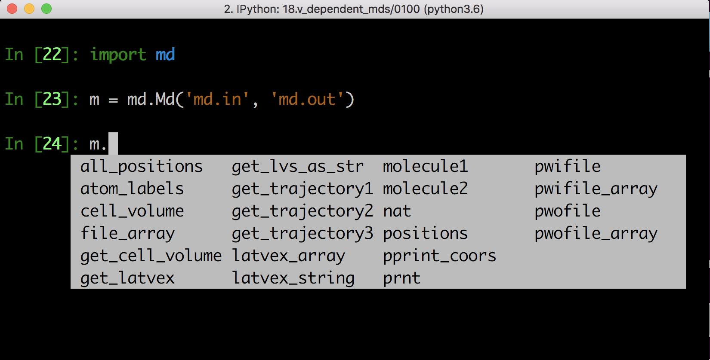
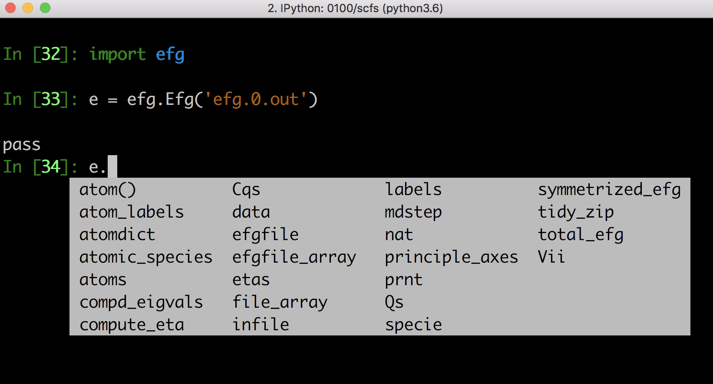
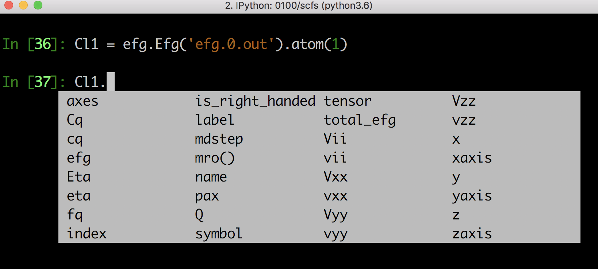
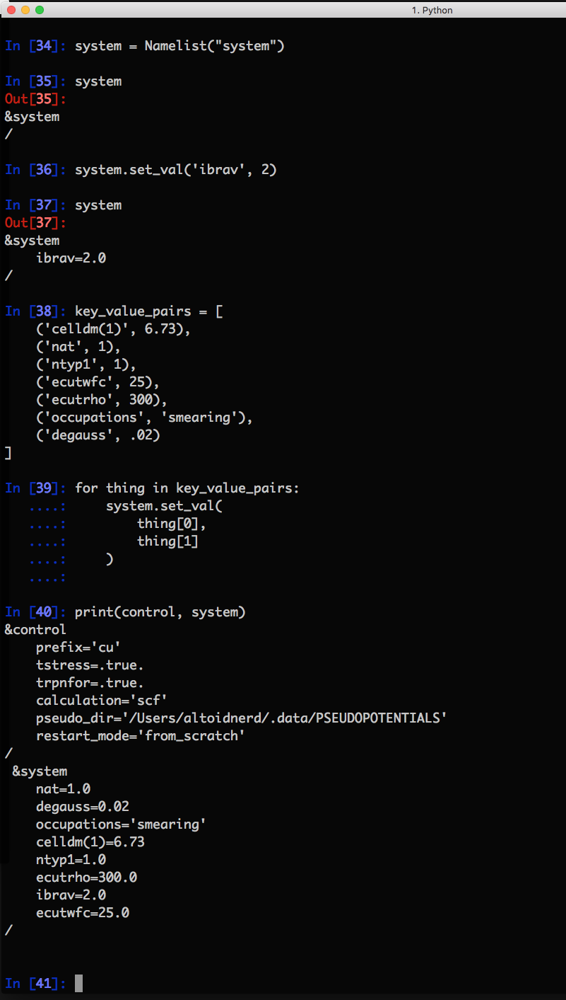

# python-pwscf
Python helper library for QUANTUM ESPRESSO


* classes for parsing and manipulating data from pw.x, and gipaw.x
  - ```md.Md(infile, outfile)``` is an object for fetching data from molecular dynamics simulations using pw.x
  - ```efg.Efg(outfile)``` is an object for fetching data from EFG calculations with gipaw.x
* ```namelist.Namelist()``` is for scripting the creation of input files for pw.x
* fundamental constants
* atomic data (mass, gyromagnetic ratios, quadrupole moments, etc)








